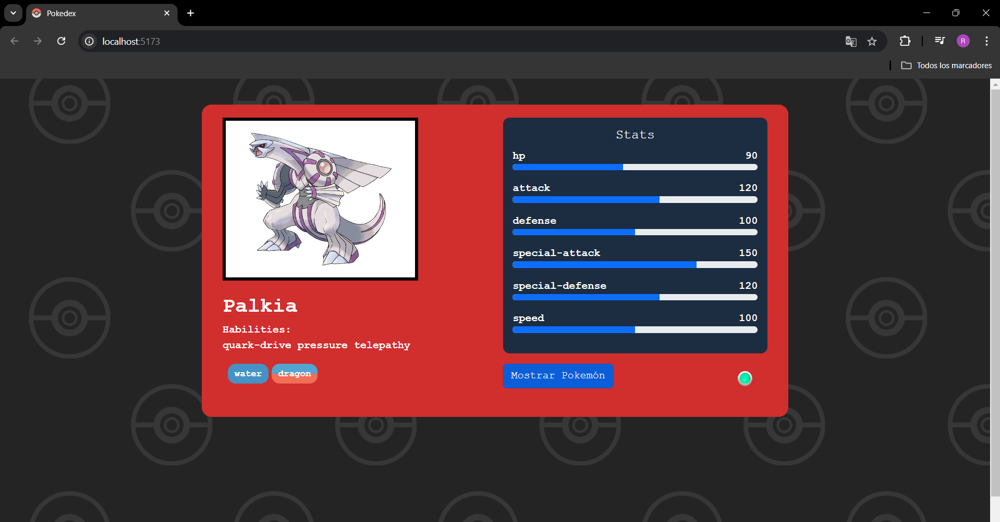

# Prueba Técnica Pokedex 

Este proyecto es una Pokédex web desarrollada con **React**, **Bootstrap** y **Axios**. Consume datos de la [PokeAPI](https://pokeapi.co/) y muestra dinámicamente diferentes Pokémon cada 30 segundos o cuando el usuario presiona un botón. El diseño está mejorado con Bootstrap, mientras que Axios gestiona las solicitudes a la API.

## Características:
- Muestra un nuevo Pokémon cada 30 segundos o mediante la interacción con un botón.
- Estilizado con Bootstrap para un diseño limpio y adaptable.
- Utiliza Axios para consumir la API de PokeAPI.

[https://devrodox.github.io/Pokedex/](https://devrodox.github.io/Pokedex/)

 

